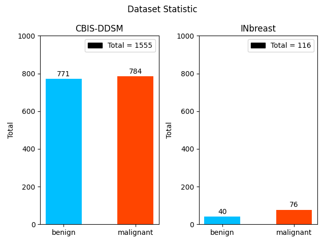
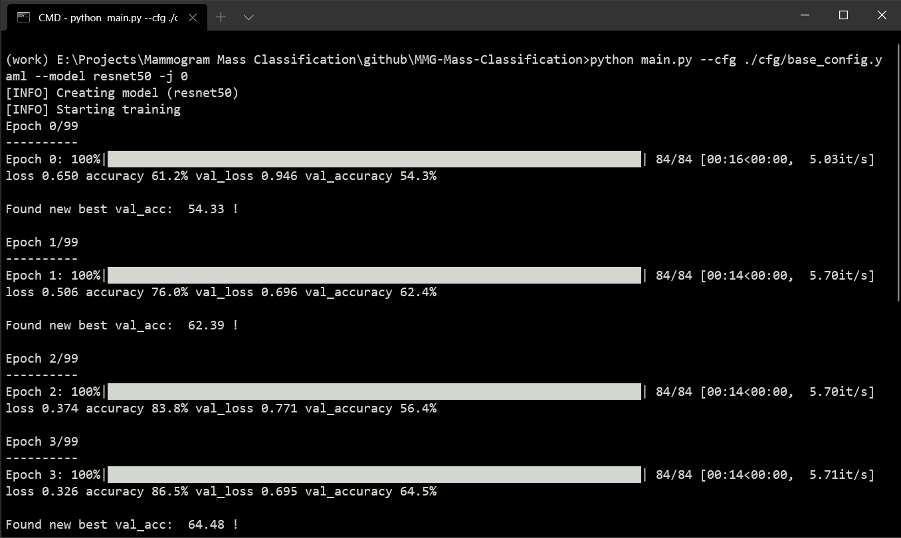
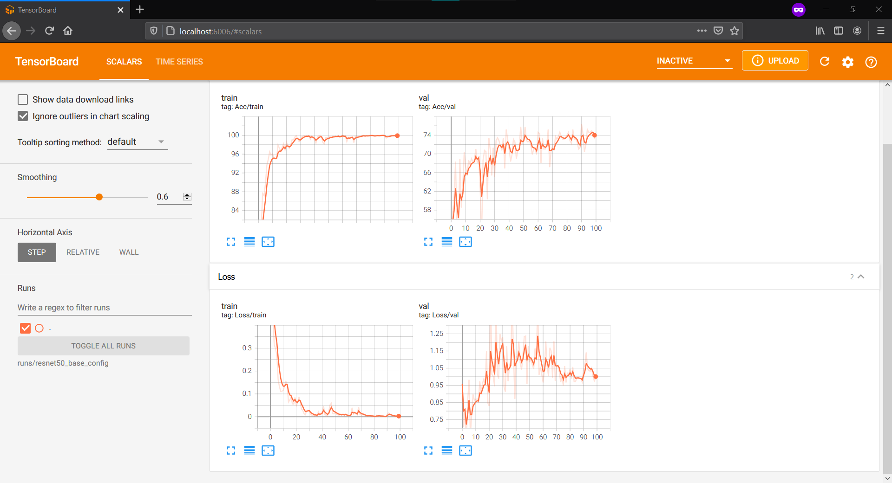
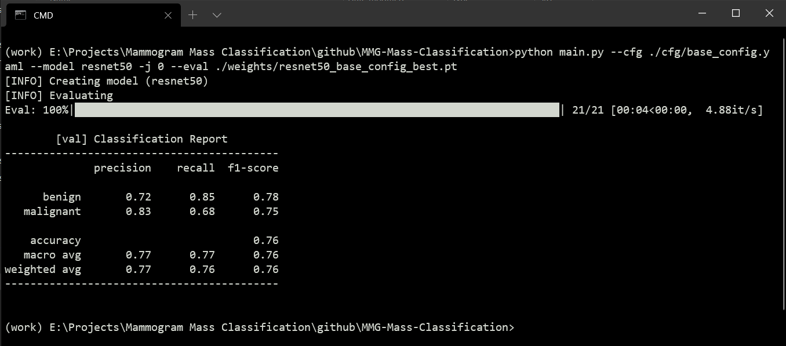
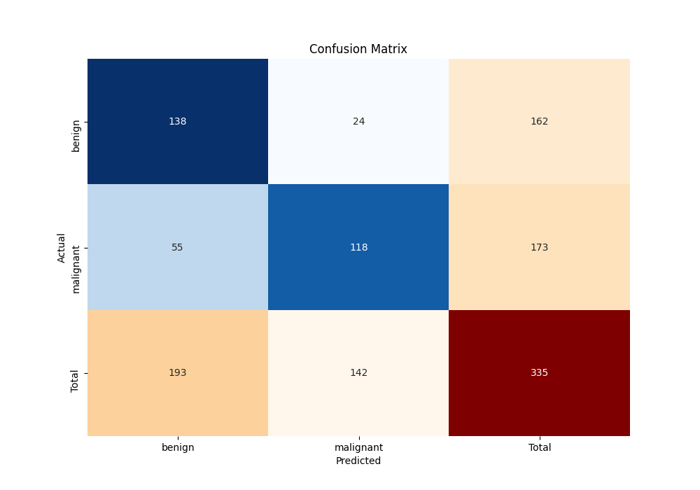

# MMG-Mass-Classification
A minimal image classification using PyTorch and Torchvision models to classify malignancy of mammogram masses (patch images). <br/>
There are two classes of malignancy: benign and malignant

## Dataset
Patch images were extracted from the following mammogram databases:
#### CBIS-DDSM
```
R. S. Lee, F. Gimenez, A. Hoogi, K. K. Miyake, M. Gorovoy, and D. L. Rubin, “Data Descriptor: A curated mammography data set for use in computer-aided detection and diagnosis research,” Sci. Data, vol. 4, pp. 1–9, 2017, doi: 10.1038/sdata.2017.177.
```
#### INbreast
```
I. C. Moreira, I. Amaral, I. Domingues, A. Cardoso, M. J. Cardoso, and J. S. Cardoso, “INbreast: Toward a Full-field Digital Mammographic Database,” Acad. Radiol., vol. 19, no. 2, pp. 236–248, 2012, doi: 10.1016/j.acra.2011.09.014.
```

<p align="center">
  
</p>


## Dependencies
- python3
- numpy
- pandas
- opencv
- pytorch
- albumentations
- matplotlib
- seaborn
- sklearn

## Tested On
- Windows 10 (num_workers need to be set to 0)

## Usage
#### Step 1: Run build_dataset.py
```
#split
python build_dataset.py --cbis path/to/cbis --inbreast path/to/inbreast split --train-ratio 0.8
python build_dataset.py --cbis path/to/cbis --inbreast path/to/inbreast --stratify split --train-ratio 0.8

#kfold
python build_dataset.py --cbis path/to/cbis --inbreast path/to/inbreast kfold --num-folds 5
python build_dataset.py --cbis path/to/cbis --inbreast path/to/inbreast --stratify kfold --num-folds 5
```
This step will generate csv file saved at ./data/

#### Step 2: Create configuration file (.yaml) and put in ./cfg/
```
data:
  train: ['./data/cbis-train.csv','./data/inbreast-train.csv']  #train: list of csv file
  val: ['./data/cbis-val.csv','./data/inbreast-val.csv']        #val: list of csv file
  nc: 2                                                         #nc (number of classes): int
  names: ['benign','malignant']                                 #names: list of classes names

hyp:
  pretrained: True              #pretrained: boolean              
  feature_extract: False        #feature_extract: boolean
  batch_size: 16                #batch_size: int
  total_epochs: 100             #total_epochs: int
  lr: 0.001                     #lr (learning rate): float
  weight_decay: 0.0001          #weight decay (L2 regularization): float
  momentum: 0.9                 #momentum: float
```

#### Step 3: Train
```
python main.py --cfg path/to/cfg --model {model_name} -j 0 --output-dir ./output/
```


#### Step 3.1 Tensorboard
```
tensorboard --logdir=runs/{model_name}_{config_name}
```


#### Step 3.2: Resume training
```
python main.py --cfg path/to/cfg --model {model_name} -j 0 --resume path/to/checkpoint.pt
```

#### Step 4: Eval
```
python main.py --cfg path/to/cfg --model {model_name} -j 0 --eval path/to/model.pt
```

<p align="center">
  
</p>

## Results
| Model | Augmentation | Accuracy | Precision (macro avg) | Recall (macro avg) | F1-Score (macro avg) | weights | config |
| :---: | :----------: | :------: | :-------------------: | :----------------: | :------------------: | :-----: | :----: |
| resnet50 | [base_transform](cfg/base_transform.py) | 0.76 | 0.77 | 0.77 | 0.76 | - | [cfg](cfg/base_config.yaml) | 